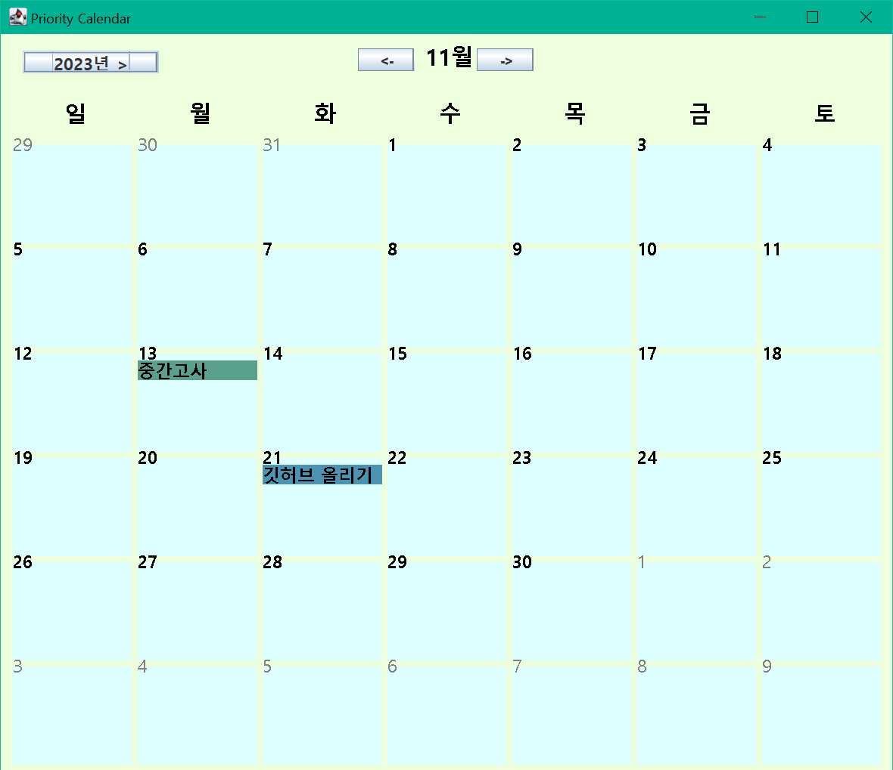
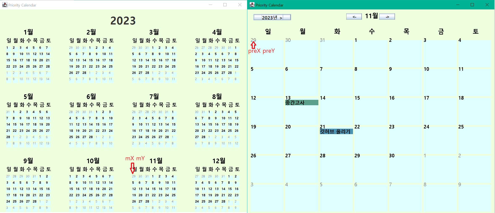
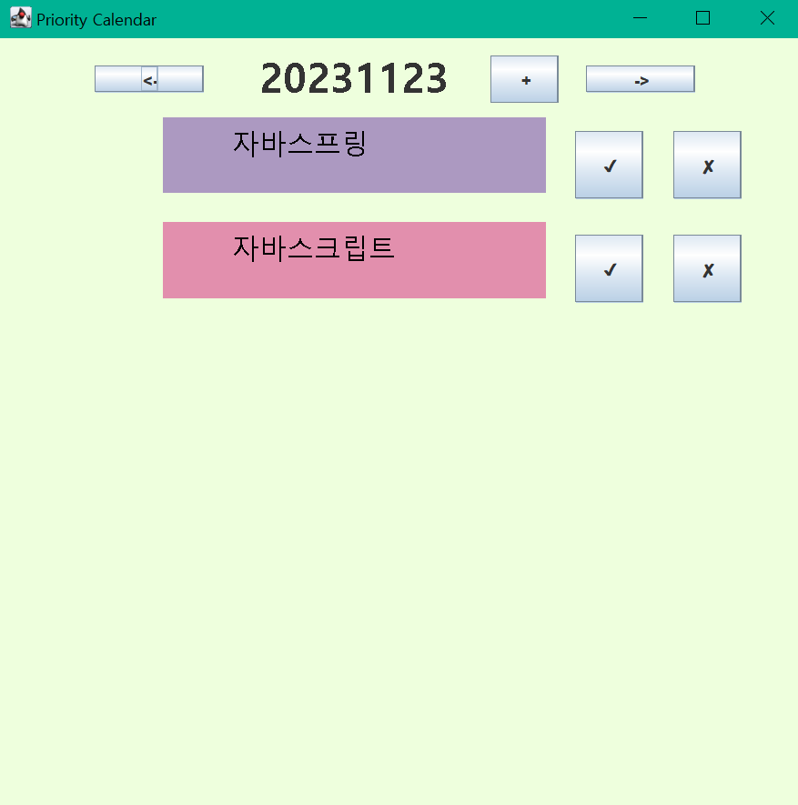
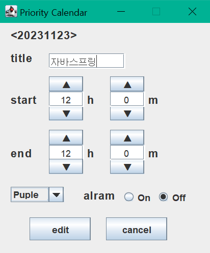

# Calendar Project

소프트웨어학과 학부생 개인 프로그램 개발 프로젝트

## 프로젝트명  
**Calendar**

<br>

## 프로젝트 소개 
자바의 스윙을 이용하여 GUI를 구축/ 쓰레드를 이용한 애니메이션/ 리스너를 이용한 버튼&클릭 이벤트 및 텍스트 입력 / 파일 입출력을 이용한 데이터 저장 및 불러오기

<br>

## 개발기간

실질적인 개발 기간 2022.08.28~2022.11.21
군복무를 하며 코딩 감각을 잊지 않기 위해 시작한 프로젝트

<br>

## 프로그램 구성

### 1) CalendarFrame
<br>



* 프로그램 시작 화면
* Calendar 클래스를 이용하여 현재 년도와 달을 계산하여 이번달에 해당하는 캘린더 화면을 보여줌.
```
Calendar cal = Calendar.getInstance();
int year = cal.get(Calendar.YEAR);
int month = cal.get(Calendar.MONTH) +1;
```
* 달력을 출력할 때 현재 월의 1일이 어느 요일인지에 따라 달력의 모양이 달라지므로 1일의 요일을 알아야 됨.
* 또한, 현재 달의 총 일수가 얼마인지 또한 알아야 함. (2월 외에는 고정. 2월의 총 일수를 알아야 함. / 현재 프로그램에서는 모든 달의 총 일수를 eod배열에 저장)
* 버튼 클릭을 통해서 이전달과 다음달로 이동 가능(액션 리스너 활용하여 year, month 변수를 수정)
```
cal.set(Calendar.DAY_OF_MONTH,1); //DAY_OF_MONTH를 1로 설정 (월의 첫날)
firstweek = cal.get(Calendar.DAY_OF_WEEK); //그 주의 요일 반환 (일:1 ~ 토:7)
eod[2]=cal.getActualMaximum(Calendar.DAY_OF_MONTH);	// 2월의 총 일수를 불러오기
```
* updateDailyPlan 함수를 이용하여 현재 월에 저장된 계획들을 불러옴. (현재 화면에 출력되는 모든 날에 해당하는 dailyPlan객체를 생성-이전달 다음달 포함)
```
private void updateDailyPlan() {
		for(int m=0;m<12;m++) {
			setCal(year,m+1);
			for(int i=0;i<42;i++) {
	    		// 저번달 마지막 날까지의 계획
	    		if(i+1<firstweek) {
	    			if(m==0) {	// 만약 현재 달이 1월이면 12월의 데이터를 불러와야 함
	    				dailyPlan[m][i] = new DailyPlan(year-1,12,eod[12]-firstweek+i+2);
	    			}
	    			else {
	    				dailyPlan[m][i] = new DailyPlan(year,m,eod[m]-firstweek+i+2);
	    			}
	    		}
	    		// 다음달 1일 부터의 계획
	    		else if(eod[m+1]>=i+2-firstweek) {
	    			dailyPlan[m][i] = new DailyPlan(year, m+1, i+2-firstweek);
	    		}
	    		// 현재 달의 계획
	    		else {
	    			if(m+1==12) { // 만약 현재 달이 12월이면 1월의 데이터를 불러와야 함
	    				dailyPlan[m][i] = new DailyPlan(year+1, 1, i-eod[m+1]-firstweek+2);
	    			}
	    			else {
	    				dailyPlan[m][i] = new DailyPlan(year, m+2, i-eod[m+1]-firstweek+2);
	    			}
	    		}
			}
		}
	}
```
* 만약 캘린더 데이터가 수정이 되더라도 쓰레드를 통해 항시 변경된 데이터를 업데이트 함.
* 하루에 저장된 계획이 4개가 넘어가면 ...을 출력 (drawString)


* 왼쪽 위에 있는 년도 버튼을 클릭하면 올해의 모든 달을 보여주는 애니메이션이 시작됨.


* 애니메이션이 시작되면 원래 월이 출력되던 달력이 출력되던 위치인 preX,preY에서 모든 달을 출력하였을 때의 mX,mY로 이동을 해야한다.


  
* 쓰레드를 이용해서 현재 달의 출력 위치를 점진적으로 모든 달이 출력하였을 때 해당 달의 위치로 이동시킴.
* 좌표 변경과 함께 출력 사이즈 또한 조정 (너비와 높이)
```
// 쓰레드가 15번이 실행되면 애니메이션 종료
monthWidth-=(monthWidth/10);
monthHeight-=(monthHeight/10);
X-=(preX-mX)/15;  // X는 현재 달의 달력 출력 X좌표
Y-=(preY-mY)/15;  // Y는 현재 달의 달력 출력 Y좌표
```
* 모든 달을 출력하는 화면에서 년도를 클릭하여 수정하면 해당 년도의 달력을 출력해 줌. (JTextField implements KeyListener를 이용하여 year변수를 변경)


* 12월 중 하나를 클릭하면 해당 달로 돌아감.
* 클릭 시 애니메이션 실행, 위의 애니메이션을 반대로 실행 (마우스 리스너 사용)


<br>

### 2) DailyPlan

<br>

* 위에서 언급한 특정 날의 저장된 계획을 불러오고 화면에 출력하는 클래스 (불러오기와 출력은 메소드 형태로 만들어서 실질적으로 CalendarFrame에서 활용)
```
// 계획 불러오기
void readFile() {
		BufferedReader reader;
		fileName = "./" + Integer.toString(y*10000+m*100+d);  // 파일 형식은 "년도"+"월"+"일"으로 구성되어 있음
		if(new File(fileName).exists()) {  // 파일이 존재한다면
			try {
				reader = new BufferedReader(new FileReader(fileName));
				String s;
				String[] newStr;
        // for문을 이용하여 라인이 비어있을 때까지 파일을 읽어옴(readLine은 한 줄을 통째로 가져옴./ 한줄에 하나의 계획)
				for(int i=0;i<N&&((s=reader.readLine())!=null);i++) {  // 여기서 N은 화면의 크기에는 한계가 있으니 화면에 보여줄 최대 계획 갯수+1
					newStr = s.split("@%");  // 파일에서 각기 다른 정보를 구분하기 위하여 split을 사용(@%에 의는 없음 내가 설정한 정보 구분을 위한 문자열)
					title[i]=newStr[0];
					color[i]=newStr[1];
				}
			} catch (FileNotFoundException e) {  // 파일 입출력은 예외를 설정 해주어야 함.
				e.printStackTrace();
			} catch (IOException e) {
				e.printStackTrace();
			}
		}
	}
```
```
// 계획 출력하기
void paint(Graphics g, int X, int Y, int w, int h) {
		for(int i=0;i<N&&title[i]!=null;i++) {	// 배열에 저장된 정보가 없으면 for문 종료
			if(i==(N-1)) {
				g.drawString(etc, X, Y+(i-1)*h/5+23);	// 더 이상 출력할 칸이 없으면 ...을 출력함으로써 표시
				break;
			}
			g.setColor(new Color(Integer.parseInt(color[i], 16))); // new Color(int rgb값)
			// rgb값은 16진수로 저장되어 있으므로 parseInt 메소드에 16을 매개변수로 설정
			g.drawRect(X, Y+(i*h/5), w, h/5);	// 칸을 나누어 줌
			g.fillRect(X, Y+(i*h/5), w, h/5);	// 칸의 색을 칠함
			g.setColor(Color.BLACK);	// 출력 생상 변경
			g.drawString(title[i], X, Y+(i*h/5)+15);	// 계획 제목을 출력
		}
	}
```
<br>

### 3) DailyFrmae
<br>



<br>

* CalendarFrame에서 특정 날을 클릭했을 때 DailyFrame이 생성된다. (1개가 이미 생성되어 있으면 여러 개가 생성 되지 않음. - 이미 창이 떠있으면 MouseListener를 사용 못하게 return시킴.)
* 버튼 이벤트는 액션리스너를 활용
* 상단에 있는 +와 화살표 버튼은 각각 계획 추가 및 날짜의 이동을 의미한다. (+ 계획을 추가 할 수 있는 EditFrame 생성 / <- 이전 날짜로 / -> 다음 날짜로)
  - 날짜가 변경 되었을 때 만약 월이 달라진다면 월이 달라졌다는 것을 의미하는 flag(boolean)를 CalendarFrame에 전달한다. (leftFlag는 이전 달로 / rightFlag는 다음 달로)
  - CalendarFrame에서 flag가 변경되었음을 확인하면 month를 변경 후 해당 flag를 false로 바꿔준다.


 
* 파일 입출력을 통해 계획을 읽어와 화면에 출력 (계획 옆에 V와 X 버튼이 생성됨.)
* V 버튼 클릭은 계획의 수정 (계획을 수정할 수 있는 EditFrame 생성) / X 버튼 클릭은 계획의 삭제를 의미

```
for(int i=0;i<N;i++) {	// 현재 클릭한 버튼은 i+(page-1)*N+1번 째에 해당하는 일정의 버튼이다. (N은 현재 화면에 출력되는 계획의 갯수)
            	if(b.equals(edit[i])) {	// V 버튼을 클릭했다면
            		editFrame = new EditFrame(year, month, date, i+(page-1)*N+1);	// editFrame을 생성
            	}
            	if(b.equals(delete[i])) {	// 파일 삭제
            		if(new File(fileName).exists()) {	// 파일이 존재한다면
            			String dummy = "";	// 덮어씌울 문자열을 저장하기 위한 변수
						try {
							reader = new BufferedReader(new FileReader(fileName));
							String line;
							for(int p=1;p<i+(page-1)*N+1;p++) {	// 삭제하고자 하는 라인 이전 줄까지의 데이터를 읽어오기
								line = reader.readLine();
								dummy += (line + "\r\n");
							}
							reader.readLine();	// 삭제하고자 하는 라인 건너뛰기
							while((line=reader.readLine())!=null) {	// 삭제하고자 하는 라인 이후 읽어오기
								dummy += (line + "\r\n");
							}
							dummy = dummy.trim();	// 맨 앞과 뒤 띄어쓰기 삭제
							FileWriter fw = new FileWriter(fileName,false);	// 파일 덮어쓰기
							fw.write(dummy);
							fw.close();
						} catch (Exception er) {
							er.printStackTrace();
						}
					}
            	}
}
```

<br>
<br>

### 4) EditFrame
<br>

 


<br>

* 계획의 추가와 수정을 담당하는 클래스
* eidt이라는 변수를 통해 추가인지 수정인지를 구분 (edit이 0이면 추가를, edit이 1이상이면 수정을 의미)
  - edit은 수정하고자 하는 계획이 몇 번째 계획인지를 의미하기도 함.
 
```
// 계획의 추가를 담당하는 메소드
void add(String title, String color, int startH, int startM, int endH, int endM, int alarm) {
		// 파일 입출력
		 try {
			 File file = new File(fileName);
			 if (!file.exists()) {	// 파일이 존재하지 않는다면
				 file.createNewFile();	// 새로운 파일을 생성
			 }
			 FileWriter fw = new FileWriter(file,true);
			 //위와 같이 생성자의 2번째 파라미터를 true로 하면, 기존에 작성된 파일이 있을 경우, 그 뒤에 이어 붙여서 문자열이 써진다.
			 BufferedWriter writer = new BufferedWriter(fw);
			 if(file.exists()) {	// 파일이 존재하면
				 try {
					 BufferedReader reader = new BufferedReader(new FileReader(file));
					 if(reader.readLine()!=null) writer.write("\n"); 
					 writer.write(title+"@%"+color+"@%"+startH+"@%"+startM+"@%"+endH+"@%"+endM+"@%"+alarm);	// 계획에 관련된 정보를 작성
					 writer.close();
					} catch (FileNotFoundException e) {
						e.printStackTrace();
					} catch (IOException e) {
						e.printStackTrace();
					}
			 }
			 
		 }
		 catch (IOException e) {            
			 e.printStackTrace();
		 }
}
```
```
// 계획의 수정을 위한 창 출력 시에 이전에 가지고 있던 계획의 정보를 불러오는 메소드
private void editInfo() {
		if(new File(fileName).exists()) {	// 파일이 존재한다면
			try {
				BufferedReader reader = new BufferedReader(new FileReader(fileName));
				String line;
				String[] newStr;
				for(int i=1;i<edit;i++) {	// 수정하고자 하는 라인 이전까지 읽어오기
					line = reader.readLine();
				}
				line = reader.readLine();	// 수정하고자 하는 라인
				newStr = line.split("@%");	// 수정 전에 가지고 있던 정보 가져오기
				// 원래 가지고 있던 정보를 각각에 해당하는 변수에 저장
				titleText.setText(newStr[0]);
				for(int i=0;i<colorArray.length;i++) {	// 현재 색깔에 맞는 인덱스 값 구하여 선택되게 만들기
					if(newStr[1].equals(colorArray[i])) jComboBox.setSelectedIndex(i);
				}
				startTextH.setText(newStr[2]);
				startTextM.setText(newStr[3]);
				endTextH.setText(newStr[4]);
				endTextM.setText(newStr[5]);
				if(Integer.parseInt(newStr[6])==1) {
					alramOn.setSelected(true);
				}
				
			} catch (FileNotFoundException e) {
				e.printStackTrace();
			} catch (IOException e) {
				e.printStackTrace();
			}
		}
}
```
```
// 수정을 위해 작성된 정보를 파일에 업데이트
if(b.getText().equals("edit")) {
		// 작성된 정보를 각각의 변수에 저장
            	if(alramOn.isSelected()) alramInt = 1;
            	else alramInt = 0;
            	int startH = Integer.parseInt(startTextH.getText());
            	int startM = Integer.parseInt(startTextM.getText());
            	int endH = Integer.parseInt(endTextH.getText());
            	int endM = Integer.parseInt(endTextM.getText());
            	if(titleText.getText().equals("")) {	// 제목 입력을 하지 않았을 경우 경고 메세지 출력
            		JOptionPane.showMessageDialog(null, "제목을 입력하십시오.");
            		return;
            	}
            	if(startH<0||startH>23||startM<0||startM>59||endH<0||endH>23||endM<0||endM>59) {	// 입력된 시간이 잘못 됐을 경우 경고 메세지 출력
            		JOptionPane.showMessageDialog(null, "일정 시간을 다시 확인하십시오.");
            		return;
            	}
            	// 앞의 경고에 걸리지 않았으면 텍스트 파일에 추가 정보 저장
            	for(int i=0;i<5;i++) {	// 선택된 콤보박스에 맞는 rgb값 전달
            		if(jComboBox.getSelectedItem().toString().equals(optionsToChoose[i])) {
            			if(new File(fileName).exists()) {	// 파일이 존재한다면
                			String dummy = "";	// 파일에 덮어쓸 내용을 보관할 변수
        					try {
        						BufferedReader reader = new BufferedReader(new FileReader(fileName));
        						String line;
        						for(int p=1;p<edit;p++) {	// 삭제하고자 하는 라인 이전까지 읽어오기
        							line = reader.readLine();
        							dummy += (line + "\r\n");
        						}
        						reader.readLine();	// 수정하고자 하는 라인 넘어가기
        						dummy +=(titleText.getText()+"@%"+colorArray[i]+"@%"+startH+"@%"+startM+"@%"+endH+"@%"+endM+"@%"+Integer.toString(alramInt)+"\r\n");	// 수정할 정보를 추가
        						while((line=reader.readLine())!=null) {	// 삭제하고자 하는 라인 이후의 데이터 읽어오기
        							dummy += (line + "\r\n");
        						}
        						dummy = dummy.trim();	// 맨 앞과 뒤 띄어쓰기 삭제
        						FileWriter fw = new FileWriter(fileName,false);	// 파일 덮어쓰기
        						fw.write(dummy);
        						fw.close();
        					} catch (Exception er) {
        						er.printStackTrace();
        					}
                    	}
            		}
            	}
            	dispose();
}
```
